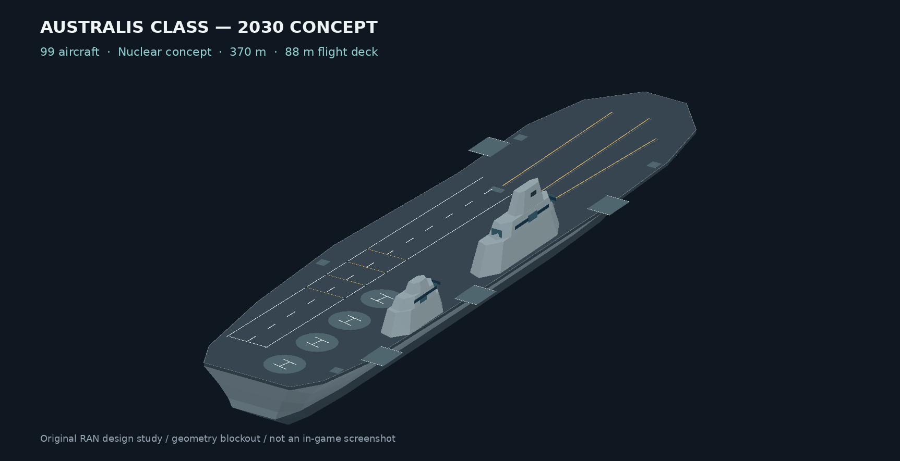
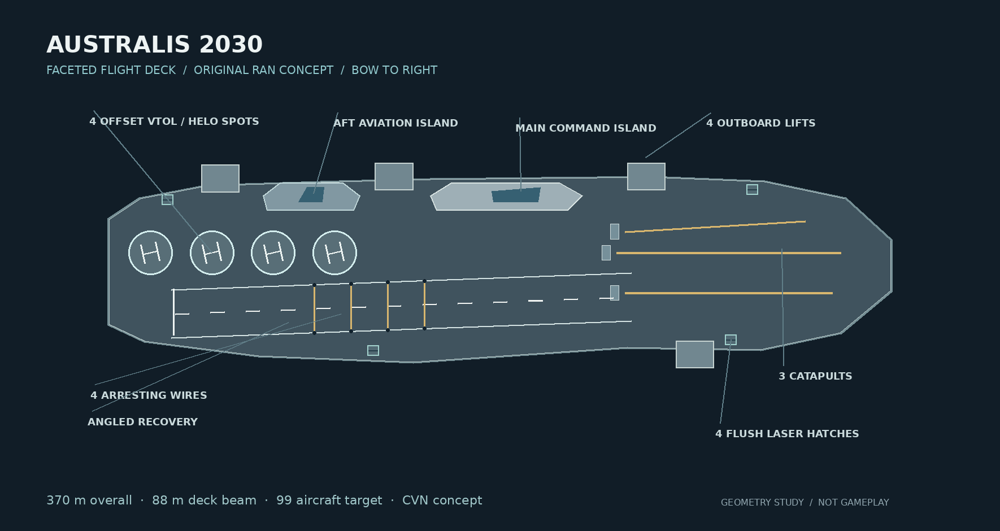
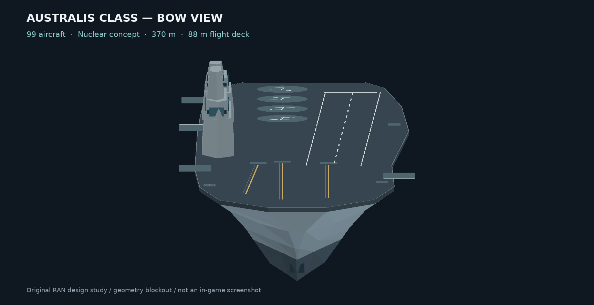

# Royal Australian Navy carrier game design

## Current focus: Australis 2030

We are refining the newest Australis first, then moving backward through its earlier concepts. The original 2030 silhouette, editable model source, deck plan and rendered preview are in [australis-2030](australis-2030/README.md).

[Open the interactive 3D model](australis-2030/viewer/australis_2030_3d.html) to rotate and inspect the deck, radar panels and laser hatches. Use **Deploy four lasers** to see the raised visual state. Download the self-contained HTML file to open it offline.

The revised 2030 study has a slimmer 88 m flight deck, an approximately 44 m maximum waterline beam, high continuous topsides and a fine immersed bow. Four offset VTOL/helicopter spots now form a line near the aft island. Two bow catapults, a starboard catapult, three blast-deflector panels, an angled recovery lane and four arresting cables are marked on the deck. Radar faces sit on the sides of both islands; four defensive laser positions have flush hatches in the default mesh and a separate raised visual state. The 99-aircraft capacity and combat systems are design targets. Hull volume and plan-view spacing are calculated in the [design notes](australis-2030/README.md), but stability, seakeeping and aircraft operations are not validated. A separate [opt-in Australis Sea Power editor package](game-mod/RAN-Carrier-Australis-2030/) now includes our own geometry, materials and a native-style vessel definition. Its references pass static validation; **Mission Editor loading remains untested**. See the [test steps](australis-2030/GAME-TEST.md). The earlier 14 fleet studies remain below as reference.

## Earlier fleet studies

Fourteen original Sea Power carrier **designs** covering every edition in the brief. The models and gameplay figures are proposals for an alternate-history RAN fleet. They are not tested as a playable mod.

| Era | Proposed class | Propulsion | Aircraft | Offensive ECM | Laser |
|---|---|---|---:|---|---|
| 1940s early | Endeavour | Steam | 30 | — | — |
| 1940s late | Sydney | Steam | 30 | — | — |
| 1950s early | Melbourne | Steam | 30 | — | — |
| 1950s late | Melbourne | Steam | 30 | — | — |
| 1960s early | Australia | Steam | 68 | — | — |
| 1960s late | Federation | Nuclear | 68 | — | — |
| 1970s early | Federation | Nuclear | 69 | 1 shipboard | — |
| 1970s late | Canberra | Nuclear | 69 | 1 shipboard | — |
| 1980s early | Commonwealth | Nuclear | 98 | 1 shipboard | — |
| 1980s late | Commonwealth | Nuclear | 98 | 1 shipboard | — |
| 1990s early | Commonwealth | Nuclear | 98 | 1 shipboard | — |
| 2000s early | Southern Cross | Nuclear | 98 | 1 shipboard | — |
| 2000s late | Southern Cross | Nuclear | 98 | 1 shipboard | — |
| 2020s early | Australis | Nuclear | 99 | 1 shipboard | 4 mounts (concept) |

Each edition has a separate design sheet with the proposed air group, dated combat systems and hull dimensions. `design-manifest.json` provides machine-readable values, including a single carrier-mounted offensive ECM module from 1972 onward. ECM uses no aircraft slots and there is no carrier-dedicated EF-111N aircraft. The 2023 hull has four visible laser mount studies; beam weapon logic and effects need implementation and testing.

`metre-source-models/` holds the original OBJ/MTL authoring coordinates. `game-scale-models/ships/` holds approximately scaled copies using one observed Sea Power OBJ reference ratio, with the same object groups (Hull, FlightDeck, elevators, catapult markings, ECM and laser mounts). `previews/` are geometry renders, not screenshots. `generate_source_models.py` rebuilds the original metre models from `fleet-source.json` with Python, NumPy and Pillow; `rebuild_game_scale.py` recreates the approximate game-scale OBJ copies from the packaged metre sources. The design manifest remains the editable source of the gameplay proposals.

`draft-ini/` has Sea Power-shaped **reference templates**, including eight original ECM sensor profiles with native-style `Kind=ECM` and `Type=Offensive` fields. The files deliberately end in `.draft.ini`. Do not copy them into the live game's `StreamingAssets/user` tree. They omit engine-required taxi paths, launch/recovery points, collision, animations, damage models, materials, aircraft IDs, weapon mounts, sonar routing and an operational laser. Ship propulsion labels are design requirements; the game's native nuclear-power type remains to be confirmed. Numeric ECM performance is proposed game balance, constrained in practice by jamming and horizon calculations.

The 1944–1959 light fleet series follows British wartime light-carrier design cues. The 1963–1993 hulls draw from US conventional and nuclear supercarrier lineages but have newly authored Australian silhouettes and fittings. The 2002–2023 Southern Cross and Australis hulls have distinct Australian decks, islands and sensor/weapon outlines. No third-party hull geometry, textures or INIs are included. `CREDITS.md` records the provenance of the one external scale reference.

The Australis editor test uses the supplied smaller reference archives of stock Forrestal/Nimitz and Workshop carrier INIs to map lifts, taxi, launch and recovery sections against the original Australis mesh. The large 5.21 GiB Drive archive remains unreviewed here. The prototype intentionally leaves its air group empty and combat effects inactive until editor load and basic deck behavior are checked in Sea Power. Source design geometry may require reshaping for physically safe deck cycles. No in-game flight, radar, sonar, ECM or laser tests have been claimed.

## Source notes

- Sea Power carrier INI format, navigation fields and ECM key names were checked against the local Project Southern Cross examples supplied earlier in this conversation. They are used as schema reference only.
- The [Project Southern Cross Workshop page](https://steamcommunity.com/sharedfiles/filedetails/?id=3574957049) credits Peter Garrett. Specific third-party models would require their own permission and contributor checks if incorporated later.
